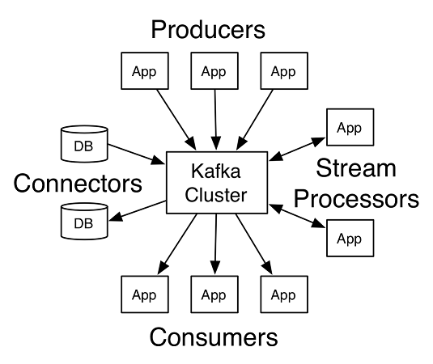
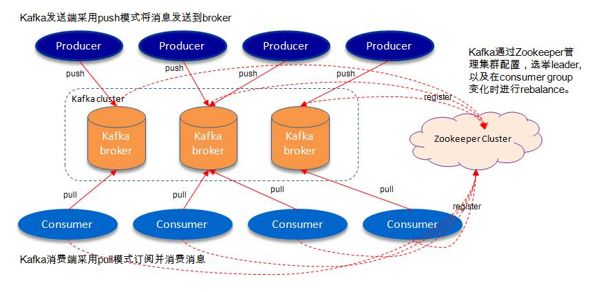
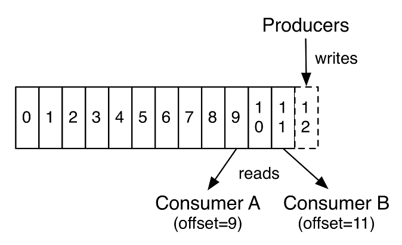

# Kafka简单分享

## 前言
由于公司技术架构变化并推行微服务架构的原因，现在和以后使用到`消息中间件`的
情况会变得很常见。在这么多常用的`消息中间件`中，**Kafka**也算是业界标杆，所以
今天来跟同事们介绍一下**Kafka**。

因为大部分同事可能对**Kafka**比较陌生，所以此次分享的内容会比较简单。大概介绍一下
其`部署`，`相关名词`介绍和`简单使用`，让大家心里有数，等到实际使用的时候可以
再去自行探究。(~~前些日子跑去出差了，摸了好久才把这个摸出来了，大家将就着看吧~~:laughing:。

## 目录
* Kafka简介
* 部署
* Producer API使用
* Customer API使用
* FAQ
* Reference

## Kafka简介

**Apache Kafka® 是 一个分布式流处理平台. 这到底意味着什么呢?**

我们知道流处理平台有以下三种特性:
* 可以让你发布和订阅流式的记录。这一方面与消息队列或者企业消息系统类似。
* 可以储存流式的记录，并且有较好的容错性。
* 可以在流式记录产生时就进行处理。

Kafka适合什么样的场景?

它可以用于两大类别的应用:

* 构造实时流数据管道，它可以在系统或应用之间可靠地获取数据。 (相当于message queue)
* 构建实时流式应用程序，对这些流数据进行转换或者影响。 (就是流处理，通过kafka stream topic和topic之间内部进行变化)

首先是一些概念:

* Kafka作为一个集群，运行在一台或者多台服务器上.
* Kafka 通过 topic 对存储的流数据进行分类。
* 每条记录中包含一个key，一个value和一个timestamp（时间戳）。

Kafka有四个核心的API:

* **Producer API** 允许一个应用程序发布一串流式的数据到一个或者多个Kafka `topic`。
* **Consumer API** 允许一个应用程序订阅一个或多个 `topic` ，并且对发布给他们的流式数据进行处理。
* **Streams API** 允许一个应用程序作为一个流处理器，消费一个或者多个`topic`产生的输入流，然后生产一个输出流到一个或多个`topic`中去，在输入输出流中进行有效的转换。
* **Connector API** 允许构建并运行可重用的生产者或者消费者，将Kafka `topics`连接到已存在的应用程序或者数据系统。比如，连接到一个关系型数据库，捕捉表（table）的所有变更内容。



### Kafka相关名词分析

* **Broker**:Kafka节点，一个Kafka节点就是一个broker，多个broker可以组成一个Kafka集群
* **Topic**:一类消息，消息存放的目录即主题，Kafka集群能够同时负责多个topic的分发
* **Massage**:Kafka中最基本的传递对象。
* **Partition**:topic物理上的分组，一个topic可以分为多个partition，每个partition是一个有序的队列
* **Producer**:生产者，生产message发送到topic
* **Consumer**:消费者，订阅topic并消费message, consumer作为一个线程来消费
* **Consumer Group**:消费者组，一个Consumer Group包含多个consumer
* **Offset**:偏移量，每条消息在文件中的位置称为offset，offset为一个long型的数字，它唯一标记一条消息

下面做进一步说明：

**broker**即kafka程序实例节点，kafka程序运行于`zookeeper`之上，`zookeeper`是一个分布式的，分布式应用程序的协调服务。
`zookeeper`提供的功能包括：leader选举、配置维护、域名服务、分布式同步、组服务等。
在此处，`zookeeper`用于协调Kafka集群的工作，Kafka集群中有多个**broker**实例节点。



**topic**即主题，kafka中发布消息、订阅消息的对象是**topic**。
我们可以为每类数据创建一个**topic**。一个**topic**中的消息数据会分配到不同的**partition**中，
分区是kafka消息队列组织的最小单位(并不是物理上的最小单位)，一个分区可以看作是一个`FIFO（ First Input First Output的缩写，先进先出队列）`的队列。

例如，一个**topic**被分成了3个分区（即partition0~2），用户发布**message**时，
可以指定**message**所处**topic**的**partition**，如果没有指定，
则随机分布到该**topic**的**partition**。发布的消息（其实是逻辑日志）将在**partition**尾部插入。


每个分区都是有序且顺序不可变的记录集，并且不断地追加到结构化的commit log文件。
分区中的每一个记录都会分配一个id号来表示顺序，我们称之为**offset**，
**offset**用来唯一的标识分区中每一条记录。

Kafka 集群保留所有发布的记录—无论他们是否已被消费—并通过一个可配置的参数——保留期限来控制。
举个例子， 如果保留策略设置为2天，一条记录发布后两天内，可以随时被消费，
两天过后这条记录会被抛弃并释放磁盘空间。
Kafka的性能和数据大小无关，所以长时间存储数据没有什么问题。



事实上，在每一个消费者中唯一保存的元数据是offset（偏移量）即消费在log中的位置。
偏移量由消费者所控制:通常在读取记录后，消费者会以线性的方式增加偏移量，但是实际上，
由于这个位置由消费者控制，所以消费者可以采用任何顺序来消费记录。
例如，一个消费者可以重置到一个旧的偏移量，从而重新处理过去的数据；
也可以跳过最近的记录，从"现在"开始消费。

关于**Consumer**与**Consumer Group**

消费者使用一个**消费组**名称来进行标识，发布到topic中的每条记录被分配给订阅消费组中的一个消费者实例.消费者实例可以分布在多个进程中或者多个机器上。

如果所有的消费者实例在同一消费组中，消息记录会负载平衡到每一个消费者实例.

如果所有的消费者实例在不同的消费组中，每条消息记录会广播到所有的消费者进程.


如图，这个 Kafka 集群有两台 server 的，四个分区(p0-p3)和两个消费者组。消费组A有两个消费者，消费组B有四个消费者。

通常情况下，每个 topic 都会有一些消费组，一个消费组对应一个"逻辑订阅者"。一个消费组由许多消费者实例组成，便于扩展和容错。这就是发布和订阅的概念，只不过订阅者是一组消费者而不是单个的进程。

在Kafka中实现消费的方式是将日志中的分区划分到每一个消费者实例上，以便在任何时间，每个实例都是分区唯一的消费者。维护消费组中的消费关系由Kafka协议动态处理。如果新的实例加入组，他们将从组中其他成员处接管一些 partition 分区;如果一个实例消失，拥有的分区将被分发到剩余的实例。

Kafka 只保证分区内的记录是有序的，而不保证主题中不同分区的顺序。每个 partition 分区按照key值排序足以满足大多数应用程序的需求。但如果你需要总记录在所有记录的上面，可使用仅有一个分区的主题来实现，这意味着每个消费者组只有一个消费者进程。

## 部署

#### step1
首先去官网[下载](https://kafka.apache.org/downloads)Kafka，因为华为云使用的版本是`kafka_2.11-0.11.0.1`，所以我就拿这个版本
来做示例~

#### step2
解压下载好Kafka，Kafka控制脚本在Linux和Windows平台有所不同，
Linux相关脚本都在`\bin`目录下，Windows则需要使用`\bin\windows`内的`bat`脚本。

#### step3
因为Kafka需要依赖Zookeeper，你可以使用已有的Zookeeper集群，这里为了方便演示我直接使用跟Kafka打包在一起的Zookeeper。

设置Zookeeper的端口，修改`\config\zookeeper.properties`：
```properties
# the port at which the clients will connect
clientPort=2181
```
启动单个Zookeeper服务，在命令行中运行：
```
bin\windows\zookeeper-server-start.bat config\zookeeper.properties
```
#### step4
启动完Zookeeper，接下来启动一个Kafka Broker实例，首先修改配置指定Zookeeper的地址，
修改`\config\server.properties`:
```properties
############################# Zookeeper #############################

# Zookeeper connection string (see zookeeper docs for details).
# This is a comma separated host:port pairs, each corresponding to a zk
# server. e.g. "127.0.0.1:3000,127.0.0.1:3001,127.0.0.1:3002".
# You can also append an optional chroot string to the urls to specify the
# root directory for all kafka znodes.
zookeeper.connect=localhost:2181

# Timeout in ms for connecting to zookeeper
zookeeper.connection.timeout.ms=6000
```
修改完成后命令行运行：
```
bin\windows\kafka-server-start.bat config\server.properties
```

此时我们的单机版Kafka服务就可以使用了，因为机器比较辣鸡，这里就不部署集群版了，感
兴趣的小伙伴可以去官网查看教程。

## API使用
因为我们公司目前都在用**Spring Boot**来进行后端开发，所以我用**Spring Boot**做了
两个demo来演示一下**Producer API**与**Consumer API**：
* producer-demo
* consumer-demo